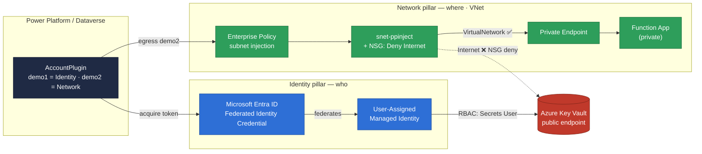
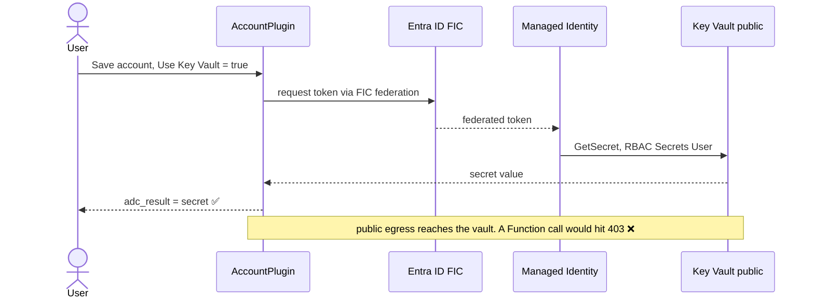
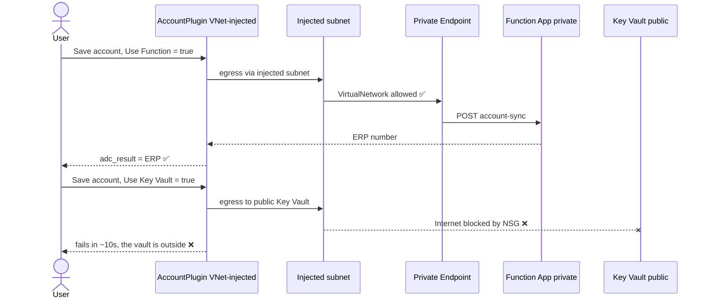
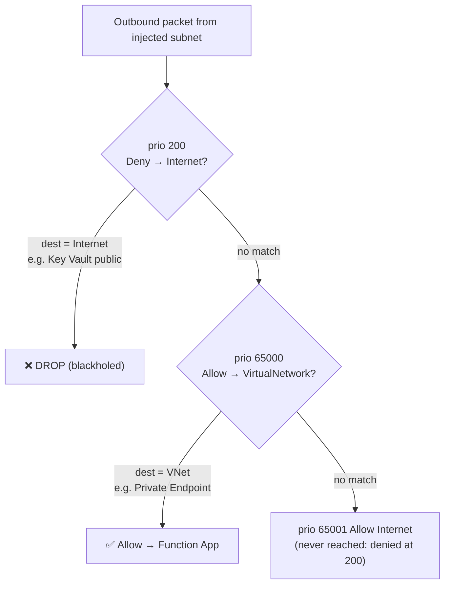
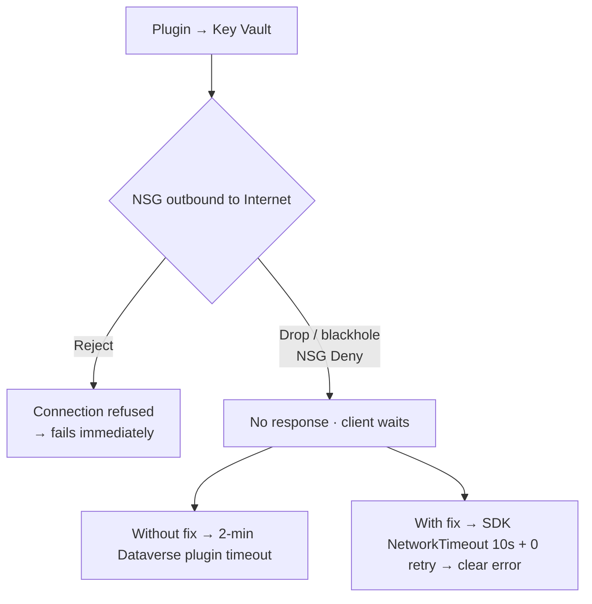

# Secure Outbound Plugin (Dataverse — Identity + Network)

A Microsoft Dynamics 365 / Dataverse **cloud plug-in** that demonstrates a secure outbound channel
along its **two pillars** — **Identity** and **Network** — with **no secrets in configuration**:

- **Identity:** the plug-in authenticates with a **Managed Identity** (`IManagedIdentityService`)
  and reads a secret from **Azure Key Vault** (RBAC, no stored credential).
- **Network:** the plug-in calls a **private Function App** reachable only through a VNet /
  private endpoint (Power Platform **subnet injection**), with a **NSG** that blocks public internet.

Two boolean fields select the pillar; both write to one `adc_result` field. The same code + managed
solution run in **two environments**, each demonstrating one pillar (and failing the other on purpose).

### The 2×2 demo matrix

|                                   | ☑️ `adc_usekeyvault`                        | ☑️ `adc_usefunction`                            |
|-----------------------------------|---------------------------------------------|-------------------------------------------------|
| **demo1 — Identity (no VNet)**    | ✅ secret read via Managed Identity          | ❌ private Function not reachable               |
| **demo2 — Network (VNet)**        | ❌ Key Vault is outside the VNet (NSG)       | ✅ Function reached through the injected subnet |

### Architecture at a glance



- **Identity flow (top):** `AccountPlugin` → Entra **FIC** → **Managed Identity** → **Key Vault** (RBAC).
- **Network flow (bottom):** `AccountPlugin` → **Enterprise Policy** → **VNet subnet + NSG** →
  **Private Endpoint** → **Function App**; the NSG **drops** any Internet egress, so the public
  Key Vault is unreachable from the injected env.
- **demo1** (no VNet) uses the top flow → KV ✅ / Function ❌. **demo2** (VNet) uses the bottom flow →
  Function ✅ / KV ❌.

### Sequence — demo1 (Identity, no VNet)



### Sequence — demo2 (Network, VNet)



> **Naming** (publisher prefix `adc_`): Solution `SecureOutboundIntegration` · Assembly
> `SecureOutboundPlugin` · Namespace `Dataverse.SecureOutbound` · Plugin class
> `Dataverse.SecureOutbound.AccountPlugin`.

---

## How the plug-in works

Registered on **Account → Update → Post-Operation (Synchronous)**, filtered on
`adc_usekeyvault,adc_usefunction`, with a **Post-Image** (`accountid, name, accountnumber`):

1. Runs only when one of the two booleans is set to `true` in the update.
2. Reads three **Environment Variables**: `adc_KeyVaultUrl`, `adc_KeyVaultAccountSecretName`, `adc_ErpApiUrl`.
3. `adc_usekeyvault` → acquires a token via `IManagedIdentityService`, reads the Key Vault secret,
   writes it to `adc_result`.
4. `adc_usefunction` → POSTs the account (`accountId`, `name`, `crmNumber=accountnumber`) to the
   Function App (demo bearer token), writes the returned ERP number to `adc_result`.
5. Failures carry a clear, demo-ready message (Function unreachable / Key Vault outside the network).

---

## Prerequisites

- **Two** Dynamics 365 / Power Platform environments (System Administrator) — one per pillar.
- An **Azure subscription** (rights to create RG, Managed Identity, Key Vault, VNet + private
  Function, and to assign RBAC).
- **Visual Studio 2019/2022** with the **.NET Framework 4.6.2** developer pack (the plug-in is net462).
- **Plug-in Registration Tool** (NuGet `Microsoft.CrmSdk.XrmTooling.PluginRegistrationTool`) or `pac`.
- Plug-in **Managed Identity** enabled/federated on the tenant.
- A strong-name key `SecureOutboundPlugin.snk` (committed — identity, not a secret; **optional** for a
  plug-in *package*, kept here — see Step 2). The **code-signing certificate** is what actually matters.

---

## Step 1 — The code-signing certificate

Plug-in **Managed Identity** binds the plug-in to an identity via a **Federated Identity Credential
(FIC)** whose subject embeds the **SHA-256 of the signing certificate**. So the assembly must be
**Authenticode-signed with a certificate**, and the *same* certificate's hash must be in the FIC.
One certificate drives **both** the assembly signature and the FIC.

Generate a self-signed code-signing cert once (dev/test) and export the `.pfx`:

```powershell
$cert = New-SelfSignedCertificate -Type CodeSigningCert `
          -Subject "CN=SecureOutbound Dev Signing" -CertStoreLocation Cert:\CurrentUser\My
$pwd  = ConvertTo-SecureString "<password>" -AsPlainText -Force
Export-PfxCertificate -Cert $cert -FilePath codesign.pfx -Password $pwd
# (optional) export the public .cer if you only need the hash for the FIC:
Export-Certificate    -Cert $cert -FilePath codesign.cer
```

Keep the `.pfx` + password safe. They are used in three places: local signing, CI signing, and the
FIC subject (SHA-256). **Never commit the `.pfx`** (it's gitignored).

### One certificate per trust tier

Microsoft's guidance: a **self-signed** certificate is fine for **dev/test**, but **production** should
be signed with a certificate from a **trusted Certificate Authority**. So the certificate can differ
**per tier** — and that's handled entirely in the pipeline, because `CODE_SIGN_PFX_BASE64` is a
**per-GitHub-Environment secret** (put the self-signed cert in `DEV`/`SIT`, the CA cert in `PROD`).

> ⚠️ **The FIC must match the certificate used for that environment.** Because the cert's SHA-256 is in
> the FIC subject, each environment's Managed Identity FIC must carry the hash of the cert that signs the
> assembly deployed there: non-prod FICs → the self-signed hash, prod FIC → the CA cert hash. Provision
> each environment (`Setup-AzureResources.ps1`) with the certificate that tier uses. "Build once" holds
> **within** a tier (same cert); at the prod boundary you re-sign with the prod cert, and prod's FIC must
> match it.

---

## Step 2 — Build & signing

The plug-in targets **.NET Framework 4.6.2** with `packages.config`, so it builds with **MSBuild on
Windows** (Visual Studio). There are **two different signatures** — don't confuse them:

### Two signatures, two reasons

| Signature | Key | Required here? | Why |
|---|---|---|---|
| **Strong-name** | `.snk` | **Optional** for a plug-in *package* | Per Microsoft's [Build and package plug-in code](https://learn.microsoft.com/power-apps/developer/data-platform/build-and-package): *"Signed assemblies aren't required … with plug-in assemblies in a plug-in package, the assemblies load on the sandbox server by using a different mechanism, so signing isn't necessary."* We keep it (identity, harmless). **Caveat:** if you strong-name, *all* dependencies must be strong-named too — the official Azure SDK / Newtonsoft already are. |
| **Authenticode** | `.pfx` | **Required** in *this* project | Nothing to do with the package: it's the **Managed Identity** requirement. The **SHA-256 of this certificate is embedded in the FIC subject**, so Dataverse only accepts the MI binding if the assembly is Authenticode-signed with that exact cert. |

> In short: the Microsoft docs say strong-naming isn't needed for a plug-in *package* — true. But
> Authenticode signing **is** needed here, not for packaging, for **Managed Identity**: the certificate's
> hash lives in the Federated Identity Credential.

### Local builds sign automatically (the Release scenario)

When you build **Release** (or Debug) in Visual Studio, the csproj runs two MSBuild targets **after**
the build, **only if signing inputs are found** (and **only when not in CI**):

- `AuthenticodeSignLocal` (after `Build`) → `scripts/Sign-Assembly.ps1` → signs the **DLL** (signtool, DigiCert timestamp).
- `PackPlugin` → `nuget pack` → produces the **`.nupkg`**.
- `SignPluginPackageLocal` (after `PackPlugin`) → `scripts/Sign-NuGetPackage.ps1` → signs the **`.nupkg`**.

If no signing input is found, the targets are **inert** (build succeeds, unsigned) — nobody is blocked.

### The 3 ways to provide the certificate (+ auto-detect)

You configure this in **`signing.local.props`** (copy it from `signing.local.props.example`; it's
gitignored). Pick **one**:

| # | Option | What you set | Secret on disk? |
|---|---|---|---|
| **A** | **PFX + password** | `<CodeSignPfxPath>` + `<CodeSignPfxPassword>` | password in the (gitignored) local file |
| **B** | **PFX + Windows Credential Manager** | `<CodeSignPfxPath>` + `<CodeSignPfxCredentialTarget>` | **no** — password read from the Windows credential store |
| **C** | **Thumbprint** | `<CodeSignThumbprint>` (cert already installed in your Windows store) | **no PFX at all** |

**Auto-detect:** if you drop the PFX at `src/SecureOutboundPlugin/certs/SecureOutboundPluginSigning.pfx`,
the csproj picks it up **without** setting `<CodeSignPfxPath>`.

#### Resolution order (which input wins)

The csproj resolves two things, in this exact order:

- **Certificate:** `1.` `<CodeSignThumbprint>` (if set, **wins** — the PFX is ignored) → `2.` explicit
  `<CodeSignPfxPath>` → `3.` auto-detected `certs/SecureOutboundPluginSigning.pfx`. None → signing is inert.
- **Password** (only when a PFX is used): `1.` explicit `<CodeSignPfxPassword>` → `2.` env var
  **`SECUREOUTBOUND_PFX_PASSWORD`** → `3.` Windows Credential Manager target `<CodeSignPfxCredentialTarget>`
  (default `SecureOutboundPlugin.CodeSign`, or env `SECUREOUTBOUND_PFX_CREDENTIAL_TARGET`). None → the build fails.

> In short: **explicit (props) → env var → Credential Manager**, and a **thumbprint short-circuits everything**.

#### Setting `SECUREOUTBOUND_PFX_PASSWORD` (and the Credential Manager target)

MSBuild reads the environment **at process start**, so set the variable **before** launching Visual
Studio (or restart VS after):

```powershell
# Current PowerShell session only:
$env:SECUREOUTBOUND_PFX_PASSWORD = "<password>"

# Persist for your Windows user (then RESTART Visual Studio / the terminal):
[Environment]::SetEnvironmentVariable("SECUREOUTBOUND_PFX_PASSWORD", "<password>", "User")
#   …or in cmd:  setx SECUREOUTBOUND_PFX_PASSWORD "<password>"
# Remove later:
[Environment]::SetEnvironmentVariable("SECUREOUTBOUND_PFX_PASSWORD", $null, "User")
```

For **Option B** (no plaintext at all), store the password once in the Windows vault under the target
name the csproj expects — the signing script reads it via `CredRead`:

```powershell
cmdkey /generic:SecureOutboundPlugin.CodeSign /user:pfx /pass:"<password>"
```

> ⚠️ An env var is visible to other processes and can leak into logs — prefer **Credential Manager**
> (Option B) or a **thumbprint** (Option C); use `SECUREOUTBOUND_PFX_PASSWORD` for quick local convenience.

**Which is best?**
- 🥇 **Option C (thumbprint)** — cleanest: **no `.pfx` and no password on disk**, the cert lives in your
  Windows certificate store. Best for a developer machine.
- 🥈 **Option B (PFX in `certs/` + Credential Manager)** — if you must ship a `.pfx`: it's auto-detected
  and the password never appears in plaintext.
- 🥉 **Option A (PFX + password in `signing.local.props`)** — simplest to set up for a quick local demo;
  the password is in a gitignored file, never committed.

### The `certs/` folder & .gitignore (nothing secret is committed)

- `certs/SecureOutboundPluginSigning.pfx` is the **auto-detect** location.
- `.gitignore` excludes `signing.local.props`, `*.pfx`, `*.cer`, `codesign.pfx` → **no certificate or
  password ever reaches git**. Only `SecureOutboundPlugin.snk` (identity, not a secret) and
  `signing.local.props.example` (the empty template) are committed.

### How CI/CD detects & signs (what you'll show live)

The local targets are **disabled under `GITHUB_ACTIONS` / `TF_BUILD`** so they never clash with the
pipeline. Instead the pipeline keys off the **`CODE_SIGN_PFX_BASE64`** secret:

- **CI** (`ci.yml`) — a *"Detect code-signing secret"* step sets `enabled=true/false`:
  - secret **present** → write a temp `codesign.pfx` from the base64, `nuget sign` the `.nupkg`
    (DigiCert timestamp), then **delete** the `.pfx` (`if: always()`).
  - secret **absent** → **skip with a `::warning::`** (build & pack stay green) — so forks/PRs without
    the secret still validate.
- **CD** (`cd.yml`) — signing is **required**: it **fails fast** if the secret is missing, then
  **signs the DLL** (`signtool sign /fd SHA256 /tr …`) **and** the `.nupkg` (`nuget sign`), and deletes
  the cert at the end. The same base64 secret = the same certificate as the FIC.

### Deploy as a Plug-in Package (`.nupkg`)

Because the plug-in pulls in the Azure SDK (`Azure.Identity`, `Azure.Security.KeyVault.Secrets`),
deploy it **as a Plug-in Package** so the dependency tree travels with the assembly — **no ILMerge**
(Microsoft's dependent-assemblies capability). `nuget pack SecureOutboundPlugin.nuspec` produces the
package; register it via the Plug-in Registration Tool, `pac plugin push`, or the CD pipeline.

---

## Step 3 — Azure resources (Managed Identity + Key Vault + FIC + RBAC)

`scripts/Setup-AzureResources.ps1` provisions, **per environment**: Resource Group, a
**User-Assigned Managed Identity**, a **Key Vault** (RBAC), the **FIC** that lets Dataverse
authenticate as the MI, and the **`Key Vault Secrets User`** role assignment.

```powershell
az login
./scripts/Setup-AzureResources.ps1 `
  -TenantId "<tenant>" -SubscriptionId "<sub>" `
  -EnvironmentId "<dataverse-env-guid>" `
  -CertificatePath "codesign.pfx" -CertificatePassword "<pwd>" `
  -ResourceGroupName "rg-secure-outbound-demo" `
  -KeyVaultName "kv-secure-outbound-demo" `
  -ManagedIdentityName "mi-secure-outbound-demo"
```

Key facts:
- The **FIC subject** is `…/n/plugin/e/{environmentId}/h/{sha256OfCert}` — it ties the MI to a
  *specific Dataverse environment* and a *specific signing certificate*. Issuer
  `https://login.microsoftonline.com/{tenant}/v2.0`, audience `api://AzureADTokenExchange`.
- **One MI can hold several FICs** — one per Dataverse environment that should use it (e.g. a shared
  MI federated to both demo1 and demo2, each with its own FIC subject).
- Create the demo secret afterwards:
  `az keyvault secret set --vault-name <kv> --name AccountSecret --value "Hello-From-KeyVault-Demo"`.

---

## Step 4 — The Dataverse `managedidentity` record (+ package link)

Plug-in Managed Identity needs a **`managedidentity` record** in Dataverse, and the **plug-in package
must be associated** to it.

- **Record** — created at a **fixed GUID** (reused across environments so the operation is identical
  everywhere) carrying the MI's `applicationid` (client ID), `tenantid`, `credentialsource=2`,
  `subjectscope=1`, `version=1`:
  ```powershell
  ./scripts/managed-identity/Provision-ManagedIdentityDataverseRecord.ps1 `
    -DataverseUrl "https://<org>.crm4.dynamics.com" `
    -DataverseRecordManagedIdentityId "<fixed-mi-guid>" `
    -ApplicationId "<mi-client-id>" -TenantId "<tenant>"
  ```
- **Link** — the `pluginpackage` (and `pluginassembly`) must reference that record
  (`managedidentityid`). When you register the package with a managed identity in the maker portal /
  PRT, this link is set and travels with the solution. If the link is missing at runtime you get
  *"PluginPackage … is not associated to a Managed identity"* — reconcile it (Web API
  `PATCH pluginpackages(<id>) {"managedidentityid@odata.bind":"/managedidentities(<guid>)"}`).

---

## Step 5 — The Dataverse solution (`SecureOutboundIntegration`)

Add to the `SecureOutboundIntegration` solution (publisher prefix `adc_`):

| Component | Schema name | Type / notes |
|---|---|---|
| Boolean | `adc_usekeyvault` | Two Options, default **No** |
| Boolean | `adc_usefunction` | Two Options, default **No** |
| Text | `adc_result` | Single line, max 850 — receives the secret **or** the Function response |
| Env var | `adc_KeyVaultUrl` | String |
| Env var | `adc_KeyVaultAccountSecretName` | String (`AccountSecret`) |
| Env var | `adc_ErpApiUrl` | String (the Function URL) |
| Plug-in package | `adc_SecureOutboundPlugin` | the signed `.nupkg` |
| SDK step | Account Update Post-Op | filter `adc_usekeyvault,adc_usefunction`, Post-Image `accountid,name,accountnumber` |

> Schema names **cannot be renamed** later — create the fields fresh. Add the three fields + `adc_crmnumber`
> (or `accountnumber`) to the Account form so you can tick the boxes and see `adc_result`.

---

## Step 6 — Demo 1 (Identity, **no** VNet)

The environment runs with normal (public) egress. The Managed Identity reads the public Key Vault.

1. Run **Step 3** (Azure MI + Key Vault, firewall **public/allow**) and **Step 4** (record) for this env.
2. Set Environment Variables: `adc_KeyVaultUrl` = your KV URL, `adc_KeyVaultAccountSecretName` =
   `AccountSecret`, `adc_ErpApiUrl` = the **private** Function URL (it will be unreachable here).
3. Import the solution + ensure the package→MI link.

**Run:** open an Account → tick **Use Key Vault** → Save → `adc_result` shows the secret (Identity ✅).
Tick **Use Function** → it fails (the private Function rejects public access — Network ❌).

---

## Step 7 — Demo 2 (Network, **VNet** / subnet injection)

The environment is injected into a VNet; the plug-in reaches the **private** Function but **not** the
public Key Vault (blocked by NSG). Provision with `scripts/Provision-Demo2-Network.ps1`, or the
building blocks:

1. **Private Function + VNet** — `scripts/vnet/Setup-FunctionPrivateEndpoint.ps1 -DisablePublicNetworkAccess $true`
   creates the VNet, a **private-endpoint subnet**, an **injection subnet** (delegated to
   `Microsoft.PowerPlatform/enterprisePolicies`), the Function App (public access **OFF**), the
   private endpoint and the `privatelink.azurewebsites.net` private DNS zone linked to the VNet.
2. **Identity must still work** — provision MI + FIC (for this env's GUID) + RBAC so the MI *token*
   succeeds; the Key Vault failure must be **network**, not identity. (A shared MI with a second FIC
   is fine.)
3. **Subnet injection** — `scripts/vnet/Setup-PowerPlatformEnterprisePolicy.ps1 -EnvironmentId <demo2-env>`
   creates the NetworkInjection **enterprise policy** (Europe needs delegated subnets in **both**
   paired regions: West + North Europe) and links it to the environment.
4. **NSG (the boundary)** — on the injection subnet, an outbound rule **`Deny Internet`** (priority <
   the default `AllowInternetOutBound`) with `AllowVnetOutBound` left intact: the Function (private
   endpoint = VirtualNetwork) stays reachable, the Key Vault (public/Internet) becomes unreachable.
5. **Do NOT** apply Entra platform auth on the Function (`Configure-FunctionAuth.ps1`) — the boundary
   shown here is the network; a demo bearer token is enough.

### Linking / unlinking the enterprise policy to an environment

Two supported ways:

- **Power Platform Admin Center (UI)** — easiest: open the environment → **Settings → Network /
  Virtual network** → link (or unlink) the enterprise policy. No scripting.
- **PowerShell** — the **`Microsoft.PowerPlatform.EnterprisePolicies`** module (the same one
  `Setup-PowerPlatformEnterprisePolicy.ps1` uses). It waits for the operation to finish on its own:

  ```powershell
  Connect-AzAccount                                  # Az.Accounts
  Import-Module Microsoft.PowerPlatform.EnterprisePolicies
  $env    = "<environment-id>"
  $armId  = "/subscriptions/<sub>/resourceGroups/<rg>/providers/Microsoft.PowerPlatform/enterprisePolicies/<policy>"

  Enable-SubnetInjection  -EnvironmentId $env -PolicyArmId $armId -TenantId "<tenant>"   # link
  Disable-SubnetInjection -EnvironmentId $env                                            # unlink
  ```

> The link/unlink also exists as a raw BAP REST call
> (`POST …/environments/{id}/enterprisePolicies/NetworkInjection/link|unlink`) — that's the **internal
> API the module wraps**; prefer the UI or the module.

> ⚠️ **Subnet injection propagation** = the plug-in **sandbox hosts are recycled** to attach to the
> VNet. This takes **~30–60 min** after linking the policy (you'll briefly see *"no Sandbox Hosts
> available"* — that's the recycle in progress). **Link the environment ahead of time**, not on demand —
> the wait is too long to be interactive. For a reliable setup, use **two pre-configured environments**
> (one linked, one not) so no toggling is needed.

> ⚠️ A blocked outbound is **dropped** by the NSG (blackhole), so without mitigation the Key Vault
> SDK hangs until the **2-minute Dataverse plugin timeout**. The plug-in sets the Key Vault client to
> **NetworkTimeout 10 s + 0 retries** so the failure surfaces in ~10 s with a clear message.

**NSG rule evaluation** (lowest priority number wins, first match):



**Why the Key Vault hangs — reject vs drop:**



**Run:** tick **Use Function** → `adc_result` shows the ERP number (Network ✅). Tick **Use Key Vault**
→ fails in ~10 s: *"the vault could not be reached … the vault is outside"* (Identity boundary ❌).

---

## Step 8 — CI/CD (GitHub Actions)

Three workflows under `.github/workflows/`:

- **CI — `ci.yml`** (`self-hosted`, runs in the `DEV` environment for the signing secret):
  `nuget restore` → `msbuild` (strong-named) → `nuget pack` → `nuget sign` of the `.nupkg`
  (decodes `CODE_SIGN_PFX_BASE64` to a temp `.pfx`, signs with a DigiCert timestamp, deletes it).
  Signing is **skipped with a warning** (not a failure) when the secret is absent, so PR validation
  stays green. No artifact upload — CI is validation only.
- **Export — `export-solution.yml`** (manual): exports `SecureOutboundIntegration` from DEV (unmanaged
  + managed), unpacks both trees into `solutions/`, bumps the version, opens a PR. This is how maker
  changes (fields, step, env-var definitions) get into git.
- **CD — `cd.yml`** (`self-hosted`): on merge of a `solution-sync/DEV` PR, or manual `DEV`/`SIT`.
  Pre-flight checks → build → **Authenticode sign the DLL** (`signtool`, from `CODE_SIGN_PFX_BASE64`)
  → `nuget pack` → **sign the `.nupkg`** → **inject the signed package** into
  `solutions/SecureOutboundIntegration_managed/pluginpackages` → `pac` **pack** (Managed) →
  **ensure the Managed Identity record** (pre-import) → `pac` **import** (per-env deployment settings)
  → **associate the package with the Managed Identity** (post-import).

### How CD manages the Managed Identity (the part wired in the pipeline)

The CD wires the Managed Identity in two `Provision-ManagedIdentityDataverseRecord.ps1` passes
(each acquires a Dataverse token via client-credentials with the SPN secrets):

1. **Before import** — upsert the **`managedidentity` record** at the **fixed GUID**
   (`DATAVERSE_MANAGED_IDENTITY_GUID`) with the per-environment **`applicationid`**
   (`MANAGED_IDENTITY_APPLICATION_ID`), `credentialsource=2`, `subjectscope=1`, `version=1`.
2. **After import** — the same script with **`-AssociatePackage`** binds the imported
   `pluginpackage` (+ `pluginassembly`) to that record. A fresh install does **not** reliably carry
   the package→identity link, so it is set explicitly here — otherwise the plug-in fails with
   *"PluginPackage … is not associated to a Managed identity"*. Idempotent.

The managedidentity **record is not part of the solution** (it's per-environment data — embedding it
would overwrite each env's `applicationid` on import), and FIC creation/rotation stays in Azure
provisioning (`Setup-AzureResources.ps1`), not in CD.

### Required GitHub Environment config (DEV / SIT)

| Kind | Name |
|---|---|
| Variable | `POWER_PLATFORM_ENV_URL` |
| Variable | `MANAGED_IDENTITY_APPLICATION_ID` (the MI client ID for that env) |
| Variable | `DATAVERSE_MANAGED_IDENTITY_GUID` (fixed, same across envs) |
| Secret | `POWER_PLATFORM_CLIENT_ID`, `POWER_PLATFORM_CLIENT_SECRET`, `POWER_PLATFORM_TENANT_ID` |
| Secret | `CODE_SIGN_PFX_BASE64`, `CODE_SIGN_PFX_PASSWORD` |

> `export-solution` opens its PR with the built-in `GITHUB_TOKEN`. Enable **Settings → Actions →
> General → Workflow permissions → "Allow GitHub Actions to create and approve pull requests"** so it
> works out of the box.

The SPN must be a Dataverse **application user with System Administrator**. Per-environment values
(KV URL, secret name, Function URL) live in `power-platform/settings/deployment-settings-<ENV>.json`.

---

## Repository layout

```
src/SecureOutboundPlugin/        net462 plug-in (strong-named; local DLL+nupkg signing)
  AccountPlugin.cs               guards + orchestration (two booleans → adc_result)
  Services/KeyVaultSecretService.cs   Key Vault over Managed Identity (short timeout, no retry)
  Services/ErpService.cs              outbound call to the Function App (demo token)
  Services/EnvironmentVariableService.cs
  signing.local.props.example    sample local Authenticode config (copy to signing.local.props)
src/ErpMockFunction/             Azure Function (dotnet-isolated net8) — POST /api/erp/account-sync
scripts/
  Setup-AzureResources.ps1                 RG + MI + Key Vault + FIC + RBAC
  Provision-Demo1-Identity.ps1             one-shot: identity env
  Provision-Demo2-Network.ps1              one-shot: network env (VNet + private Function + NSG)
  Sign-Assembly.ps1 / Sign-NuGetPackage.ps1   local signers (called by the build)
  managed-identity/Provision-ManagedIdentityDataverseRecord.ps1   upsert the managedidentity record
  vnet/Setup-FunctionPrivateEndpoint.ps1   VNet + private Function App
  vnet/Setup-PowerPlatformEnterprisePolicy.ps1   subnet injection enterprise policy
  vnet/Configure-FunctionAuth.ps1          (optional) Entra platform auth — NOT used by the demo
  vnet/Test-Connectivity.ps1               DNS/TCP/TLS diagnostics
solutions/                       unpacked Dataverse solution (unmanaged + managed)
.github/workflows/               ci.yml · export-solution.yml · cd.yml
power-platform/settings/         per-environment deployment settings (env-var values)
```

---

## Troubleshooting

| Symptom | Cause / fix |
|---|---|
| Nothing happens on Save | The boolean wasn't in the Target — untick/re-tick and save. |
| *"… is not associated to a Managed identity"* | Link the plug-in package to the `managedidentity` record (Step 4). |
| *"IManagedIdentityService returned an empty token"* | MI not enabled/federated, or FIC subject/cert hash mismatch. |
| Key Vault HTTP 403 | **Demo 2 expected** (NSG/firewall). Otherwise: MI missing `Key Vault Secrets User`. |
| Function 403 "Web App - Unavailable" | **Demo 1 expected** (private, no VNet). In Demo 2: check injection/PE/DNS. |
| Key Vault hangs ~2 min | NSG drop + SDK retries — ensure the plug-in's short-timeout build is deployed. |
| Assembly fails to load on registration | Deploy as a **Plug-in Package** (`.nupkg`), not a bare DLL. |

---

## Security note

The plug-in **never logs the secret value** — only its length. The two pillars are independent:
**Identity** answers *who* may call (Managed Identity, no stored secret), **Network** answers *from
where* (private endpoint / VNet). A production design layers **both**.
